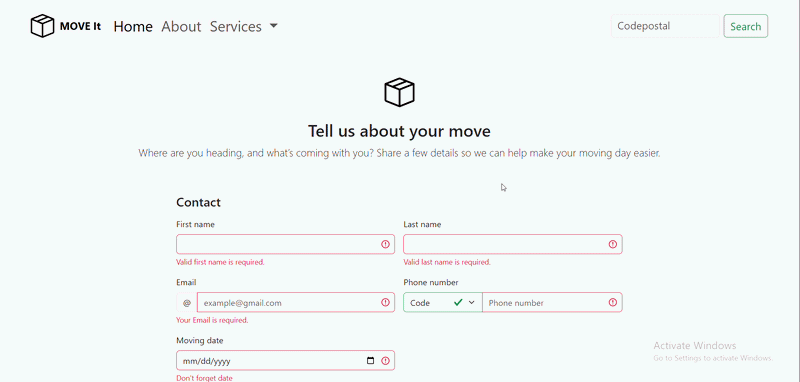
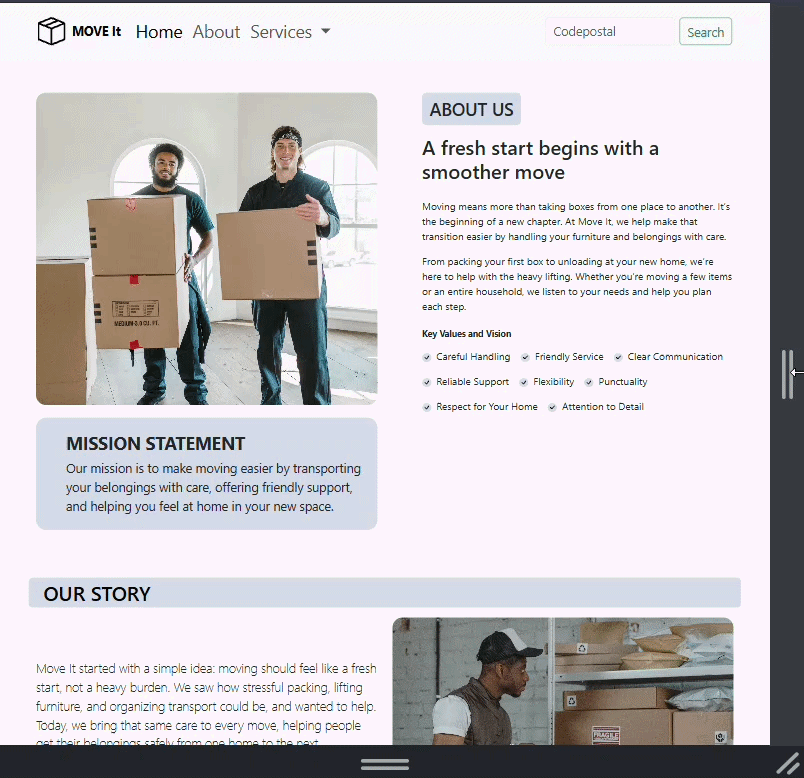
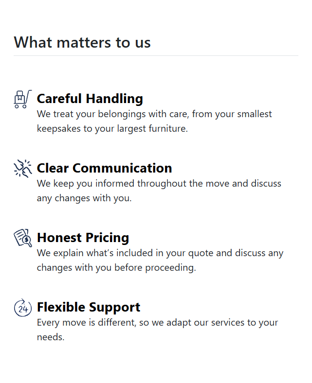
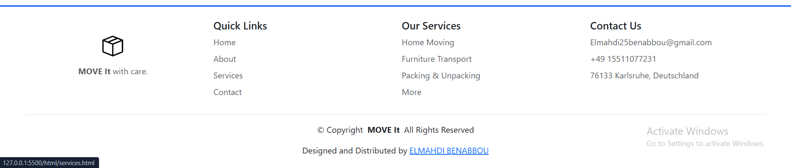
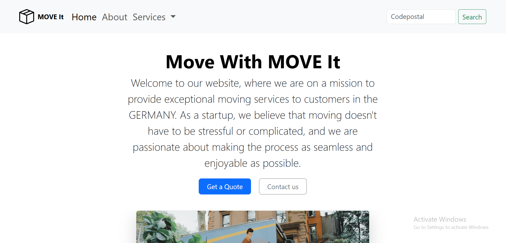

<div align="center">
  

  <h1>MOVE It 📦</h1>
  <p><strong>A fresh start deserves a smoother move.</strong></p>
  <p>A responsive moving-company website built while learning HTML, CSS, and Bootstrap.</p>

  
  
  
  

  <p>
    <a href="#preview">Preview</a> ·
    <a href="#what-you-can-explore">Features</a> ·
    <a href="#what-i-learned">What I learned</a>
    <a href="#run-it-locally">Run locally</a> ·
  </p>
</div>

<!-- BEFORE PUBLISHING:
1. Check the logo path above against your repository.
2. Replace YOUR_REPOSITORY_NAME in the clone command.
3. Add docs/move-it-demo.gif and docs/move-it-preview.png, then uncomment their image lines.
4. Add your deployed URL below once a live demo exists.
5. Check that the described features match the finished project.
6. Verify third-party template and image credits before publishing.
-->

## Why I built this

Moving can be stressful. Finding help should feel straightforward.

**Move It** is my take on a welcoming moving-company website: visitors can discover services, meet the team, and share the details of their next move. I started with Bootstrap components and adapted the content, layout, and styling around one consistent moving-company theme.

This is a fictional business and a frontend learning project. Its purpose is to show how I turn reusable components into a connected website while developing my skills as a future application developer.

## Preview

<!-- Add your live website link here: [Explore the live website](https://YOUR-LIVE-URL) -->

**A quick tour:** start on the homepage, explore the services, then try the moving-request form.


<br>



<br>



<br>



<br>



## What you can explore

| Area                  | What it offers                                                                            |
| --------------------- | ----------------------------------------------------------------------------------------- |
| **Home**              | A welcoming introduction and navigation to the main pages.                                |
| **About**             | The company story, mission, values, and fictional team.                                   |
| **Services**          | Home moving, furniture transport, and packing and unpacking.                              |
| **Moving request**    | Contact details, calling code, moving information, and space for additional instructions. |
| **Helpful details**   | A step-by-step moving guide and frequently asked questions.                               |
| **Responsive layout** | Navigation, cards, and columns that adapt to different screen sizes.                      |
| **Footer**            | Quick links, service links, and contact information.                                      |

### A closer look at the form

The contact experience helps visitors explain their move rather than simply sending a generic message. It includes personal details, a country calling code, a move type, and additional comments.

**Demo limitation:** form validation and confirmation messages are frontend interactions. Without a connected backend or form service, they do not send email, save a request, arrange a call, or create a booking. A success modal alone is not proof that information was received.

## Built with

- **HTML** — page structure, links, and form elements.
- **CSS** — custom styling, image proportions, spacing, and responsive adjustments.
- **Bootstrap** — the grid system, navigation, cards, dropdowns, forms, and modals.
- **VS Code** — editing and local development.

Bootstrap interactive components require its JavaScript bundle. Follow the dependency links already included in the project's HTML files.

## Run it locally

### 1. Get the project

Replace `YOUR_REPOSITORY_NAME` with the actual repository name:

```bash
git clone https://github.com/Elmahdi25/YOUR_REPOSITORY_NAME.git
cd YOUR_REPOSITORY_NAME
```

You can also download the repository ZIP from GitHub and extract it.

### 2. Start a local server

From the project folder, run one of these commands if Python is installed:

```bash
# Windows
py -m http.server 8000
```

```bash
# macOS / Linux
python3 -m http.server 8000
```

Open **http://localhost:8000** in your browser. If the homepage is not named `index.html`, open its filename from the directory listing.

Alternatively, use VS Code's **Live Server** extension and open the homepage with Live Server.

No package-install command is included because this README describes a plain HTML/CSS project. Internet access is needed for any dependencies loaded through CDN links.

### 3. Explore

- Resize the browser to try the responsive layout.
- Open the hamburger navigation on a smaller screen.
- Browse the service cards and FAQ.
- Try the form's required fields and confirmation interaction.

## What I learned

This project helped me understand the difference between making something look right at one size and making it work across different layouts.

- **Bootstrap's grid:** using columns and breakpoints to change layouts as screens get smaller.
- **Flexbox:** centering a card inside its column and distinguishing element alignment from text alignment.
- **Image sizing:** preserving proportions with `object-fit` and avoiding distorted icons.
- **Forms:** using labels, appropriate input types, required fields, and validation feedback.
- **Navigation:** connecting pages and linking directly to sections with IDs.
- **Customization:** adapting template components into a consistent theme instead of leaving their default content unchanged.

## Next improvements

- [ ] Add a live demo, screenshots, and a short GIF.
- [ ] Connect the moving-request form to a backend or form service.
- [ ] Expand pickup and delivery details, furniture quantities, and optional packing services.
- [ ] Check keyboard navigation, labels, contrast, and image descriptions across all pages.
- [ ] Optimize image sizes and test the site on more devices.

## Feedback and contributions

Suggestions are welcome, especially around responsive layouts, accessibility, and form usability.

If you find something that could work better, open an issue with the page, screen size, and steps to reproduce it. For a code contribution, fork the repository, make a focused change, and open a pull request explaining what changed and why.

## Credits and license

Built and customized by **[Elmahdi Benabbou](https://github.com/Elmahdi25)**.

Some starting components come from Bootstrap examples. Keep a record of any other templates, photos, and icons used, including their source and applicable terms. Third-party assets retain their own licenses and attribution requirements.

## Support the project

If you enjoyed exploring Move It, a star on the repository or useful feedback is appreciated. You can discover more of my work on **[my GitHub profile](https://github.com/Elmahdi25)**.

<!-- Optional: add a donation link here only after you set up your own donation page. -->

---

<div align="center">
  <strong>Built one component, one challenge, and one improvement at a time.</strong>
</div>
